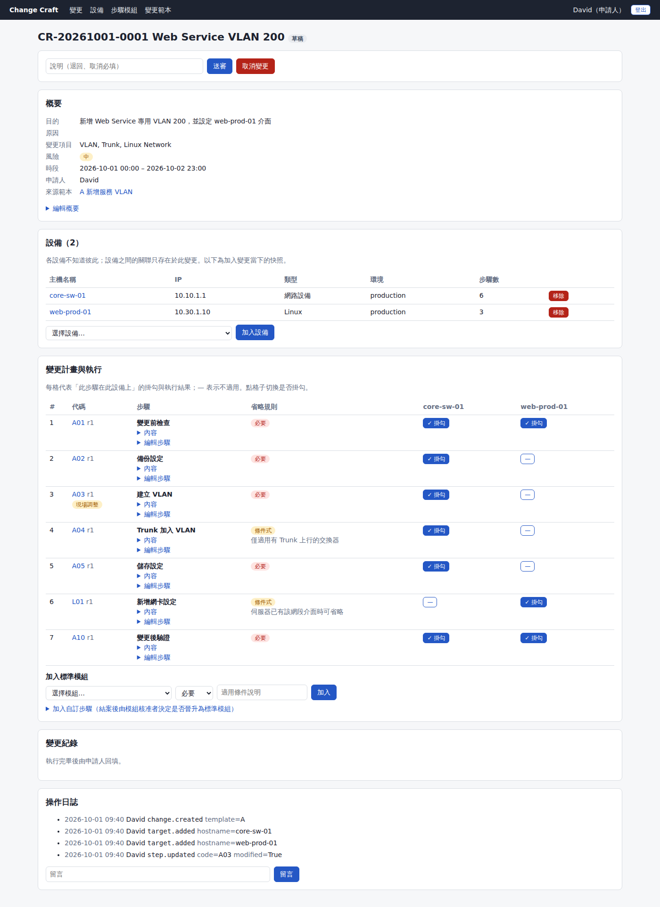
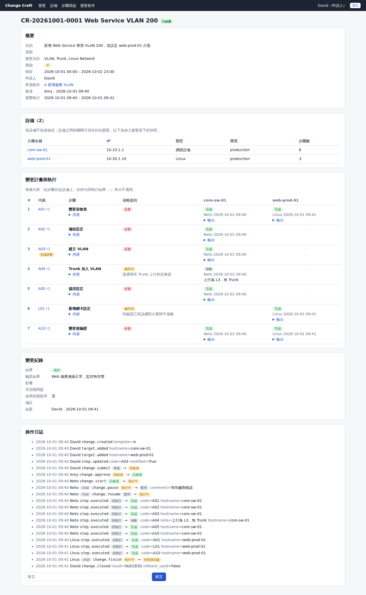
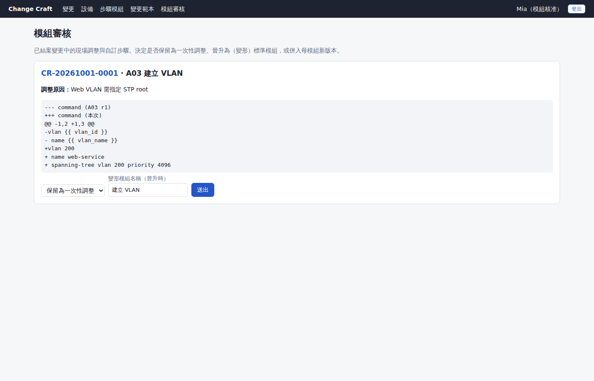
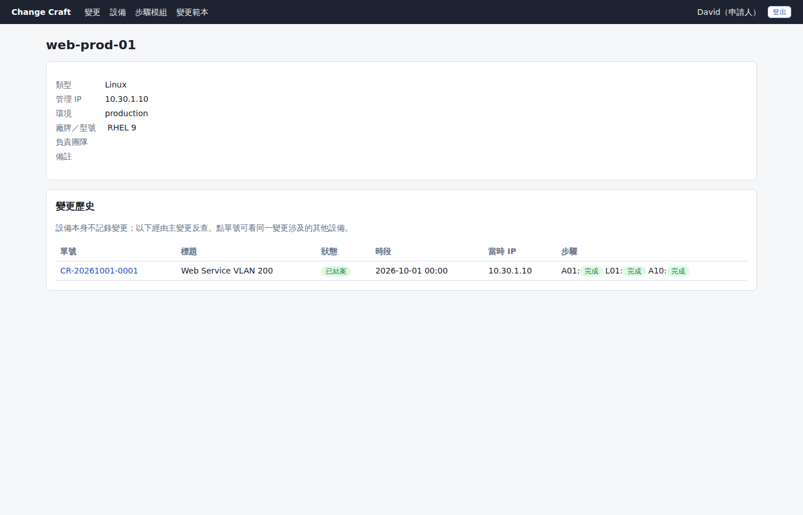

# Change Craft

變更管理系統，適用網路設備、Windows、Linux 服務。設備物件化、步驟模組化（樂高積木）、執行過程日誌化，並可透過聊天 bot（海聊）更新基礎狀態。

設計與需求對照見 [docs/design.md](docs/design.md)。



## 核心概念

```
ChangeTemplate (變更目的 A) ──組裝──▶ StepModule (A01…A10，含不可變 Revision)
        │ 帶入（快照，可微調）
        ▼
ChangeRequest ──▶ PlanStep ──┐
      │                       ├──▶ StepExecution（此步驟 × 此設備的結果）
      └──▶ ChangeTarget ──────┘
                │ 快照
                ▼
              Device（不知道自己被哪些變更修改過，也不知道同一變更的其他設備）
```

- **變更流程**：草稿 → 送審 → 核准 → 執行中（可暫停）→ 執行完畢 → 回填紀錄 → 結案。
- **省略規則**：必要（不可省略）、可省略、條件式（省略需填原因）。
- **模組演進**：計畫中的步驟可微調（需填原因），結案後由模組核准者決定保留一次性、晉升為變形模組（A01 → A01-2）或併入母模組新版本。
- **搜尋**：時間、設備名稱、IP / 網段、變更項目（含步驟名稱與模組代碼）、變更目的。

| 執行結果與操作日誌 | 結案後審核現場調整 | 設備反查變更歷史 |
|---|---|---|
|  |  |  |

## 技術棧

FastAPI + SQLAlchemy 2 + PostgreSQL 16，Jinja2 伺服器端渲染 + htmx（`hx-boost`）。單一服務部署。

## 快速開始（Docker）

```bash
cp .env.example .env        # 修改 DB_PASSWORD、SECRET_KEY
docker compose up -d --build
docker compose exec app python -m app.cli create-admin admin   # 互動式輸入密碼
docker compose exec app python -m app.cli seed-demo            # 選用：示範設備、模組、範本 A
```

開啟 http://localhost:8000 ，以 admin 登入後在「使用者」頁建立帳號並指派角色。

## 本機開發

```bash
python -m venv .venv && .venv/bin/pip install -r requirements-dev.txt
export DATABASE_URL=postgresql+psycopg://postgres@localhost:5432/changecraft
export SECRET_KEY=dev-secret COOKIE_SECURE=false
.venv/bin/alembic upgrade head
.venv/bin/uvicorn app.main:app --reload
```

測試需要一個可清空的 PostgreSQL 資料庫（預設 `changecraft_test`，測試會先 downgrade 再 upgrade）：

```bash
createdb changecraft_test
.venv/bin/pytest
```

## 環境變數

| 變數 | 說明 |
|---|---|
| `DATABASE_URL` | SQLAlchemy 連線字串（psycopg 3） |
| `SECRET_KEY` | 必填，簽署 session cookie |
| `CHAT_SECRET` | 聊天 bot 簽章金鑰；空白則停用 `/api/chat/command` |
| `BASE_URL` | 聊天回覆中的網頁連結前綴 |
| `COOKIE_SECURE` | 預設 `true`（僅 HTTPS 傳送 cookie）；本機 http 測試設 `false` |
| `TZ_NAME` | 顯示與輸入時區，預設 `Asia/Taipei` |

## 海聊整合

在海聊建立 bot，收到訊息後轉送到本系統，再把回應的 `reply` 傳回聊天室：

```
POST /api/chat/command
Content-Type: application/json
X-CC-Timestamp: <Unix 秒數>
X-CC-Signature: hex(HMAC-SHA256(CHAT_SECRET, "<timestamp>." + <raw body>))

{"user_id": "<海聊使用者 ID>", "text": "start CR-20261001-0001"}
→ {"reply": "CR-20261001-0001 …\n狀態：執行中…\nhttp://…/changes/1"}
```

- 使用者 ID 需由系統管理員在「使用者」頁綁定，權限與網頁相同。
- 指令（可加 `/change` 或 `/cc` 前綴）：`status`、`start`、`pause [說明]`、`resume`、`finish`、`comment <內容>`。
- 計畫、步驟細節、核准、結案一律回覆「請至網頁操作」並附連結。
- 時間戳與伺服器相差超過 5 分鐘即拒絕。
